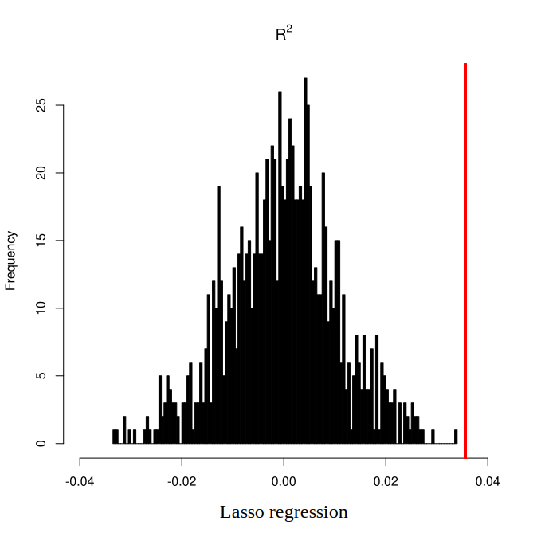

# Report of Scalar-on-Network Regression

**Abstract** There is a growing trend in learning the association between individuals’ brain connectivity networks and their clinical characteristics as well as symptoms. It requires a kind of model whose response variable is scalar, and the predictors are networks or adjacent matrices. Therefore, in this research, we developed a new boosting method for variable screening. The performance of our method was demonstrated through analysis of the rs-fMRI data. It also indicated an underlying neural structure of intelligence, which may provide another approach for diagnosis of psychiatric or other mental diseases.

## Introduction

Functional connectome fingerprinting (Finn et al., 2015) has aroused heated discussion over recent years since it implies some clinical symptoms or demographic characteristics. Previous research used various regression methods (Dubois, Galdi, Han, et al., 2018; Dubois, Galdi, Paul, et al., 2018; Tozzi et al., 2021) or dimension reduction approaches (Sripada, Angstadt, et al., 2020; Sripada, Rutherford, et al., 2020) to extract relevant information from functional connectivity. However, they either failed to perform variable screening or omitted the brain structure information, which is deficient for the identification of sub-networks or edges that contribute to certain diseases. Thus, our research goal is to find biomarkers of certain diseases or brain functions, while extracting their information as much as possible.

## Methods

### Algorithm Development

Boosting algorithm was developed to improve prediction by combining weak learners, and it has evolved into various adaptations. Among them, $L_2$ boosting has shown excellent performance in high-dimensional settings (Bühlmann, 2006), with a wide range of applications in brain imaging and genomics. Here we developed a two-stage $L_2$ boosting algorithm to perform variable selection in a group structure. The first stage is for group (brain network pairs) selection. Assume that edges (brain region pairs) that distribute in the same group have similar effects on cognition or other features. Hence, the predictors were acquired by averaging the functional connectivity within each group, and the response variables are individuals' characteristics. Then we utilize $L_2$ boosting to select informative groups. The second stage is for edge selection, we first choose edges belonging to selected groups as predictors, and still treat individuals’ characteristics as response variables, then we perform $L_2$ boosting to further select informative edges. Unlike previous algorithms which run multiple times in a cross-validation set-up, to make our method computationally attractive, we used corrected AIC/BIC criteria (Bühlmann, 2006; Chen & Chen, 2008) to stop the iteration. We prefer the AIC criterion in the first stage for small errors and the BIC criterion in the second stage to avoid overfitting.

### fMRI analysis

We applied our method to reveal neural substrates of intelligence. Treating functional connectivity matrices as predictors and general cognitive ability as response variables, a k-fold cross-validation scheme was conducted. It suggested that our method showed better performance on this task. Moreover, we achieved sparsity in predictors, which implied the neural mechanisms of intelligence. 

**Functional Connectivity generation**

To generate functional connectivity matrices, we first parcellated the brain with Kong’s parcellation (Kong et al., 2021), which exhibited the best homogeneity within each network. Time-series extraction simply consisted in averaging data from vertices within each parcel (brain region), and matrix generation in pair-wise correlating parcel time series (Pearson correlation).

**Extraction of general cognitive ability**

To acquire general cognitive ability as the response variable, we conducted an explanatory factor analysis on 10 cognitive batteries from the HCP. Using the `psych` package in `R`, we derived a common factor $g$ which loads on all test scores, and several group factors that each load on subsets of the test scores.

**K-fold cross-validation**

Finally, we evaluated our method by repeating 10-fold cross-validation 50 times. Coefficient of determination and mean squared error were calculated to evaluate the performances of each method. We also recorded their elapsed time, number of selected variables for comparison.

**Permutation test**

To further assess the performance of our method and identify the sub-network of intelligence, we developed a nonparametric permutation test. Topological null models (Váša & Mišić, 2022) were constructed by randomizing the connection points of each edge in functional connectivity matrices, while still preserving their connection strength. Then we treat the null model as predictors in cross-validation, regarding its output statistics as baselines. After that, we permutated the data both from null models and empirical models (real functional connectivity matrices) 1000 times, calculating the average distance and the significance. We specifically run permutation tests on coefficient of determination and selected times (non-zero times of $\pmb{\omega}$), in order to quantify the utility of each method and their selection robustness.

## Results

**Summary of Performance**

|  Method  |      MSE      |    ${R}^2$    |    elapsed    |     edges     |
| :------: | :-----------: | :-----------: | :-----------: | :-----------: |
| `GBoost` | 0.889 (0.051) | 0.153 (0.058) | 825.1 (32.76) | 107.9 (1.825) |
| `Lasso`  | 1.050 (0.045) | 0.008 (0.046) | 11.36 (2.399) | 60.18 (32.74) |
| `Ridge`  | 0.928 (0.030) | 0.124 (0.047) | 36.59 (4.477) |       -       |

Here, $\pmb{\mathsf{MSE}}$ is mean squared error, $R^2$ is coefficient of determination, $\pmb{\mathsf{elapsed}}$ is the running time and $\pmb{\mathsf{edges}}$ is the average number of selected edges across folds.

As we can see, our method is outperformed other regression approaches with larger explained variance. Moreover, it can robustly select informative edges across folds, while preserving information as much as possible.

**Permutation Test**

It suggested that all methods were able to predict individuals' intelligence through functional connectivity. However, compared to other methods, ours has larger effect size, indicating the well preservation when interpret the brain network. Thus the efficiency of `GBoost` was proved once more. 

**Edge Selection**

To further demonstrate the neural substrates of intelligence, we visualize the selection times of each informative edge (brain region pairs). In order to present their signal signs, I checked the $\pmb{\omega}$ value and accordingly relabeled the selected times. Specifically, for a certain edge, speculate whether its $\omega_{i,j}$ was all negative or positive across folds where it was selected, then relabeled negative edges with negative selected times, while kept positive ones the same. Fortunately, selected edges all have consistent signs across different folds. Thus there is no controversy in relabeling their selected times.

I posted some of the results below. It demonstrated average selected times of each informative edge. Their values, which are positive or negative, mean their signal signs in intelligence prediction. The color of the connection points corresponds to the networks they localize, and can be checked in [Kong's parcellation](#fMRI analysis)

It suggested that, most of the edges concentrated in the default mode network and the control network. Furthermore, the selected edges spread across all eight work, which indicates that the general cognitive ability might be the function of the whole brain. We can also observe some lateralization in edges related to the visual network and the language network, which may provide some insights into the organization of our brain.

Please check `fig >> 3D` for further detailed speculation and interactions in 3D view, or check `fig >> 2D` for 2D view.

**Reference**  
Bühlmann, P. (2006). Boosting for high-dimensional linear models. *The Annals of Statistics*, *34*(2). https://doi.org/10.1214/009053606000000092  
Dubois, J., Galdi, P., Han, Y., Paul, L. K., & Adolphs, R. (2018). Resting-State Functional Brain Connectivity Best Predicts the Personality Dimension of Openness to Experience. *Personality Neuroscience*, *1*, e6. https://doi.org/10.1017/pen.2018.8  
Dubois, J., Galdi, P., Paul, L. K., & Adolphs, R. (2018). A distributed brain network predicts general intelligence from resting-state human neuroimaging data. *Philosophical Transactions of the Royal Society B: Biological Sciences*, *373*(1756), 20170284. https://doi.org/10.1098/rstb.2017.0284  
Finn, E. S., Shen, X., Scheinost, D., Rosenberg, M. D., Huang, J., Chun, M. M., Papademetris, X., & Constable, R. T. (2015). Functional connectome fingerprinting: Identifying individuals using patterns of brain connectivity. *Nature Neuroscience*, *18*(11), 1664–1671. https://doi.org/10.1038/nn.4135  
Glasser, M. F., Smith, S. M., Marcus, D. S., Andersson, J. L. R., Auerbach, E. J., Behrens, T. E. J., Coalson, T. S., Harms, M. P., Jenkinson, M., Moeller, S., Robinson, E. C., Sotiropoulos, S. N., Xu, J., Yacoub, E., Ugurbil, K., & Van Essen, D. C. (2016). The Human Connectome Project’s neuroimaging approach. *Nature Neuroscience*, *19*(9), 1175–1187. https://doi.org/10.1038/nn.4361  
Kong, R., Yang, Q., Gordon, E., Xue, A., Yan, X., Orban, C., Zuo, X.-N., Spreng, N., Ge, T., Holmes, A., Eickhoff, S., & Yeo, B. T. T. (2021). Individual-Specific Areal-Level Parcellations Improve Functional Connectivity Prediction of Behavior. *Cerebral Cortex*, *31*(10), 4477–4500. https://doi.org/10.1093/cercor/bhab101  
Sripada, C., Angstadt, M., Rutherford, S., Taxali, A., & Shedden, K. (2020). Toward a “treadmill test” for cognition: Improved prediction of general cognitive ability from the task activated brain. *Human Brain Mapping*, *41*(12), 3186–3197. https://doi.org/10.1002/hbm.25007  
Sripada, C., Rutherford, S., Angstadt, M., Thompson, W. K., Luciana, M., Weigard, A., Hyde, L. H., & Heitzeg, M. (2020). Prediction of neurocognition in youth from resting state fMRI. *Molecular Psychiatry*, *25*(12), 3413–3421. https://doi.org/10.1038/s41380-019-0481-6  
Tozzi, L., Tuzhilina, E., Glasser, M. F., Hastie, T. J., & Williams, L. M. (2021). Relating whole-brain functional connectivity to self-reported negative emotion in a large sample of young adults using group regularized canonical correlation analysis. *NeuroImage*, *237*, 118137. https://doi.org/10.1016/j.neuroimage.2021.118137  
Váša, F., & Mišić, B. (2022). Null models in network neuroscience. *Nature Reviews Neuroscience*, *23*(8), 493–504. https://doi.org/10.1038/s41583-022-00601-9
